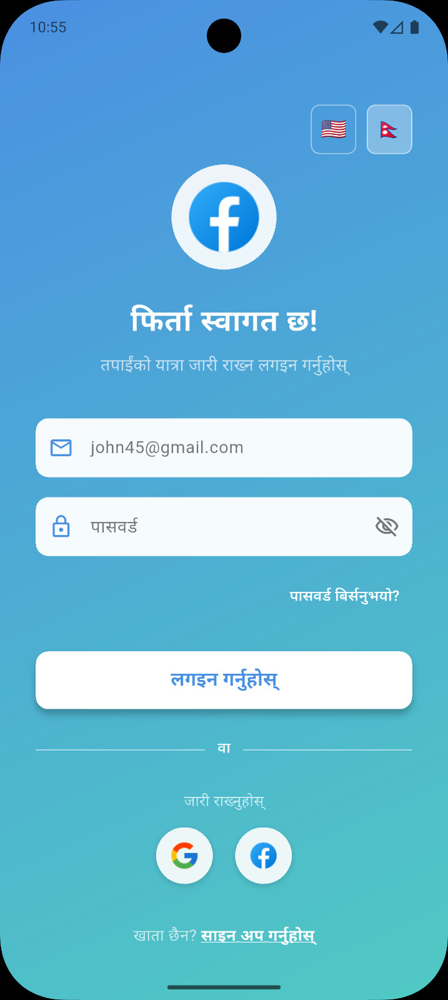
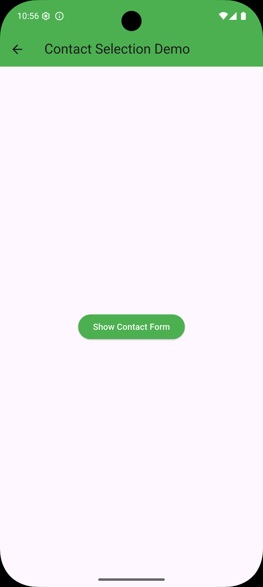
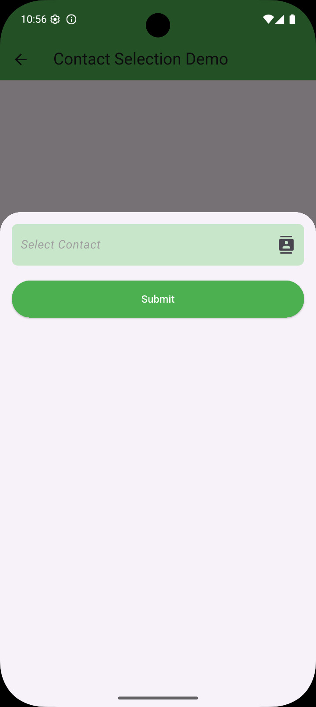
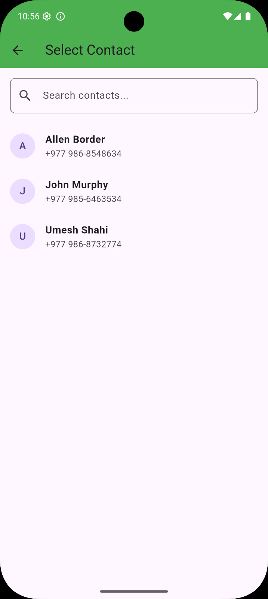
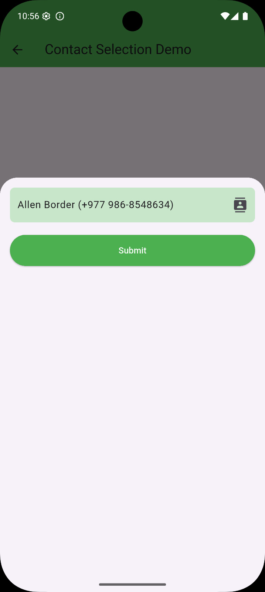

# myapp - Flutter eSewa Payment Integration

## 📱 App Preview

<p align="center">
  
  
  
  
  
  
  
  
</p>

## 🚀 Features

- **eSewa Payment Integration**: Complete implementation of Nepal's popular payment gateway
- **Modern UI**: Clean and intuitive user interface
- **Infinite Scroll**: Efficient pagination for large data sets
- **Network Image Caching**: Optimized image loading with caching
- **Localization Support**: Multi-language support with intl package
- **Contact Integration**: Access device contacts with permission handling
- **Google Fonts**: Custom typography for enhanced visual appeal
- **Toast Notifications**: User feedback with fluttertoast

## 📋 Prerequisites

- Flutter SDK (version 3.8.1 or compatible)
- Dart SDK
- Android Studio or VS Code with Flutter extension
- eSewa merchant account for payment processing

## 🛠️ Installation

1. **Clone the repository**

   ```bash
   git clone <repository-url>
   cd myapp
   ```

2. **Install dependencies**

   ```bash
   flutter pub get
   ```

3. **Configure eSewa credentials**

   - Obtain your merchant ID and secret key from eSewa
   - Update the configuration in `lib/config/esewa_config.dart`

4. **Run the application**
   ```bash
   flutter run
   ```

## 📦 Dependencies

The project uses the following key packages:

- **http**: For API calls and eSewa integration
- **infinite_scroll_pagination**: For efficient list pagination
- **cached_network_image**: For optimized image loading
- **flutter_localizations** & **intl**: For localization
- **google_fonts**: For custom typography
- **permission_handler**: For runtime permissions
- **flutter_contacts**: For contact access
- **fluttertoast**: For user notifications

## 🔧 Configuration

### eSewa Setup

1. Register as a merchant at [eSewa](https://esewa.com.np/)
2. Obtain your merchant ID and secret key
3. Update the configuration in the app:

```dart
// lib/config/esewa_config.dart
class EsewaConfig {
  static const String merchantId = 'YOUR_MERCHANT_ID';
  static const String secretKey = 'YOUR_SECRET_KEY';
  static const String baseUrl = 'https://rc-epay.esewa.com.np/api/epay/main/v2/';
  static const String successUrl = 'https://yourdomain.com/success';
  static const String failureUrl = 'https://yourdomain.com/failure';
}
```

### Android Configuration

Add internet permission to `android/app/src/main/AndroidManifest.xml`:

```xml
<uses-permission android:name="android.permission.INTERNET" />
<uses-permission android:name="android.permission.ACCESS_NETWORK_STATE" />
```

### iOS Configuration

Add internet permission to `ios/Runner/Info.plist`:

```xml
<key>NSAppTransportSecurity</key>
<dict>
    <key>NSAllowsArbitraryLoads</key>
    <true/>
</dict>
```

## 🏗️ Project Structure

```
lib/
├── main.dart
├── config/
│   └── esewa_config.dart
├── models/
│   └── payment_model.dart
├── services/
│   └── esewa_service.dart
├── utils/
│   └── constants.dart
├── widgets/
│   └── payment_button.dart
└── screens/
    ├── home_screen.dart
    ├── payment_screen.dart
    └── success_screen.dart
```

## 💳 Payment Integration

The app implements eSewa payment flow with the following steps:

1. **Initialize Payment**: Create payment request with amount and product details
2. **Redirect to eSewa**: Open eSewa payment page
3. **Payment Verification**: Verify transaction success/failure
4. **Result Handling**: Process payment result and update UI

Example payment initialization:

```dart
// Initialize eSewa payment
final response = await EsewaService.initiatePayment(
  amount: 1000,
  productName: 'Test Product',
  productId: '123',
);
```

## 🎨 UI Components

The app includes reusable UI components:

- **Custom AppBar**: With branding and navigation
- **Product Grid**: Display items with infinite scroll
- **Payment Form**: Input fields for payment details
- **Loading Indicators**: For async operations
- **Toast Notifications**: For user feedback

## 📊 Testing

Run tests with:

```bash
flutter test
```

The project includes:

- Unit tests for payment logic
- Widget tests for UI components
- Integration tests for payment flow

## 🚀 Building for Production

### Android APK

```bash
flutter build apk --release
```

### Android App Bundle

```bash
flutter build appbundle --release
```

### iOS

```bash
flutter build ios --release
```

## 🔒 Security Considerations

- Never commit actual merchant credentials to version control
- Use environment variables for sensitive data
- Validate all payment responses server-side
- Implement proper error handling for payment failures

## 🤝 Contributing

1. Fork the project
2. Create your feature branch (`git checkout -b feature/AmazingFeature`)
3. Commit your changes (`git commit -m 'Add some AmazingFeature'`)
4. Push to the branch (`git push origin feature/AmazingFeature`)
5. Open a Pull Request

## 📄 License

This project is licensed under the MIT License - see the LICENSE file for details.

## 🆘 Support

For support regarding:

- Flutter implementation: Check Flutter documentation
- eSewa integration: Refer to eSewa developer documentation
- App-specific issues: Open an issue in the repository

## 📞 Contact

Umesh Shahi - [GitHub Profile](https://github.com/919Umesh)
