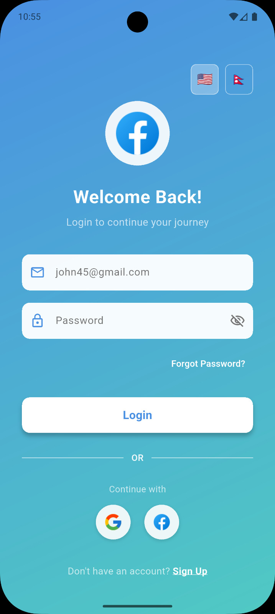

# myapp - Flutter App with Localization, Auth & Contacts

## 📱 App Preview

<p align="center">
  
  
  
  
  
  
  
  
</p>

## 🚀 Features

- **Multi-language Support**: English and Nepali localization with easy switching
- **Authentication System**: Complete login/register flow with secure token management
- **API Integration**: RESTful API calls with error handling and loading states
- **Contact Access**: Read and display device contacts with permission handling
- **Modern UI**: Clean and intuitive user interface with Google Fonts
- **Infinite Scroll**: Efficient pagination for large data sets
- **Network Image Caching**: Optimized image loading with caching
- **Toast Notifications**: User feedback with fluttertoast

## 📋 Prerequisites

- Flutter SDK (version 3.8.1 or compatible)
- Dart SDK
- Android Studio or VS Code with Flutter extension
- Backend API endpoint for authentication

## 🛠️ Installation

1. **Clone the repository**

   ```bash
   git clone <repository-url>
   cd myapp
   ```

2. **Install dependencies**

   ```bash
   flutter pub get
   ```

3. **Configure API endpoints**

   - Update the API configuration in `lib/config/api_config.dart`

4. **Run the application**
   ```bash
   flutter run
   ```

## 📦 Dependencies

The project uses the following key packages:

- **http**: For API calls and authentication
- **shared_preferences**: For storing auth tokens and user preferences
- **flutter_localizations** & **intl**: For localization support
- **provider**: For state management
- **permission_handler**: For runtime permissions
- **flutter_contacts**: For contact access
- **google_fonts**: For custom typography
- **fluttertoast**: For user notifications
- **cached_network_image**: For optimized image loading
- **infinite_scroll_pagination**: For efficient list pagination

## 🌐 Localization Setup

### Adding Supported Languages

Update `pubspec.yaml` to include localization delegates:

```yaml
flutter:
  generate: true
  assets:
    - assets/translations/
```

Create translation files in `assets/translations/`:

- `en.json` (English)
- `ne.json` (Nepali)

### Example Translation Files

**en.json:**

```json
{
  "welcome": "Welcome",
  "login": "Login",
  "email": "Email",
  "password": "Password",
  "switch_nepali": "Switch to Nepali",
  "switch_english": "Switch to English"
}
```

**ne.json:**

```json
{
  "welcome": "स्वागतम्",
  "login": "लगइन",
  "email": "इमेल",
  "password": "पासवर्ड",
  "switch_nepali": "नेपालीमा स्विच गर्नुहोस्",
  "switch_english": "अंग्रेजीमा स्विच गर्नुहोस्"
}
```

### Implementing Language Switching

```dart
// lib/providers/language_provider.dart
class LanguageProvider with ChangeNotifier {
  Locale _locale = const Locale('en');

  Locale get locale => _locale;

  void setLocale(Locale locale) {
    _locale = locale;
    notifyListeners();
  }

  void toggleLanguage() {
    _locale = _locale.languageCode == 'en'
        ? const Locale('ne')
        : const Locale('en');
    notifyListeners();
  }
}
```

## 🔐 Authentication System

### API Configuration

```dart
// lib/config/api_config.dart
class ApiConfig {
  static const String baseUrl = 'https://your-api.com/api';
  static const String loginEndpoint = '/auth/login';
  static const String registerEndpoint = '/auth/register';
  static const int connectTimeout = 5000;
  static const int receiveTimeout = 3000;
}
```

### Auth Service Implementation

```dart
// lib/services/auth_service.dart
class AuthService {
  final http.Client client;

  AuthService(this.client);

  Future<Map<String, dynamic>> login(String email, String password) async {
    final response = await client.post(
      Uri.parse('${ApiConfig.baseUrl}${ApiConfig.loginEndpoint}'),
      body: json.encode({'email': email, 'password': password}),
      headers: {'Content-Type': 'application/json'},
    );

    if (response.statusCode == 200) {
      return json.decode(response.body);
    } else {
      throw Exception('Failed to login');
    }
  }

  Future<void> logout() async {
    // Clear stored tokens
    final prefs = await SharedPreferences.getInstance();
    await prefs.remove('auth_token');
    await prefs.remove('user_data');
  }
}
```

### Auth Provider for State Management

```dart
// lib/providers/auth_provider.dart
class AuthProvider with ChangeNotifier {
  String? _token;
  User? _user;
  bool _isLoading = false;

  String? get token => _token;
  User? get user => _user;
  bool get isLoading => _isLoading;

  Future<void> login(String email, String password) async {
    _isLoading = true;
    notifyListeners();

    try {
      final response = await AuthService(http.Client()).login(email, password);
      _token = response['token'];
      _user = User.fromJson(response['user']);

      // Store token and user data
      final prefs = await SharedPreferences.getInstance();
      await prefs.setString('auth_token', _token!);
      await prefs.setString('user_data', json.encode(_user!.toJson()));

    } catch (error) {
      rethrow;
    } finally {
      _isLoading = false;
      notifyListeners();
    }
  }

  Future<void> autoLogin() async {
    final prefs = await SharedPreferences.getInstance();
    final token = prefs.getString('auth_token');
    final userData = prefs.getString('user_data');

    if (token != null && userData != null) {
      _token = token;
      _user = User.fromJson(json.decode(userData));
      notifyListeners();
    }
  }
}
```

## 📞 Contact Access Implementation

### Permission Handling

```dart
// lib/utils/permission_handler.dart
class AppPermissions {
  static Future<bool> requestContactsPermission() async {
    final status = await Permission.contacts.request();
    return status.isGranted;
  }

  static Future<bool> hasContactsPermission() async {
    final status = await Permission.contacts.status;
    return status.isGranted;
  }
}
```

### Contact Service

```dart
// lib/services/contact_service.dart
class ContactService {
  static Future<List<Contact>> getContacts() async {
    try {
      final hasPermission = await AppPermissions.hasContactsPermission();
      if (!hasPermission) {
        final granted = await AppPermissions.requestContactsPermission();
        if (!granted) {
          throw Exception('Contacts permission denied');
        }
      }

      final contacts = await FlutterContacts.getContacts(
        withProperties: true,
        withThumbnail: true,
      );

      return contacts;
    } catch (e) {
      throw Exception('Failed to fetch contacts: $e');
    }
  }
}
```

### Contact Provider

```dart
// lib/providers/contact_provider.dart
class ContactProvider with ChangeNotifier {
  List<Contact> _contacts = [];
  bool _isLoading = false;
  String? _error;

  List<Contact> get contacts => _contacts;
  bool get isLoading => _isLoading;
  String? get error => _error;

  Future<void> loadContacts() async {
    _isLoading = true;
    _error = null;
    notifyListeners();

    try {
      _contacts = await ContactService.getContacts();
    } catch (e) {
      _error = e.toString();
    } finally {
      _isLoading = false;
      notifyListeners();
    }
  }
}
```

## 🏗️ Project Structure

```
lib/
├── main.dart
├── config/
│   └── api_config.dart
├── models/
│   ├── user_model.dart
│   └── contact_model.dart
├── services/
│   ├── auth_service.dart
│   ├── api_service.dart
│   └── contact_service.dart
├── providers/
│   ├── auth_provider.dart
│   ├── language_provider.dart
│   └── contact_provider.dart
├── utils/
│   ├── constants.dart
│   ├── permission_handler.dart
│   └── localization.dart
├── widgets/
│   ├── language_switch.dart
│   ├── auth_form.dart
│   └── contact_list.dart
└── screens/
    ├── login_screen.dart
    ├── home_screen.dart
    ├── contacts_screen.dart
    └── profile_screen.dart
```

## 🔧 Configuration

### Android Permissions

Add required permissions to `android/app/src/main/AndroidManifest.xml`:

```xml
<uses-permission android:name="android.permission.INTERNET" />
<uses-permission android:name="android.permission.ACCESS_NETWORK_STATE" />
<uses-permission android:name="android.permission.READ_CONTACTS" />
```

### iOS Permissions

Add permissions to `ios/Runner/Info.plist`:

```xml
<key>NSContactsUsageDescription</key>
<string>This app needs access to contacts to display them</string>
<key>NSAppTransportSecurity</key>
<dict>
    <key>NSAllowsArbitraryLoads</key>
    <true/>
</dict>
```

## 📊 API Call Example

```dart
// Example of API call with error handling
Future<void> fetchUserData() async {
  try {
    final response = await http.get(
      Uri.parse('${ApiConfig.baseUrl}/user/profile'),
      headers: {
        'Authorization': 'Bearer $token',
        'Content-Type': 'application/json',
      },
    );

    if (response.statusCode == 200) {
      final userData = json.decode(response.body);
      // Process data
    } else if (response.statusCode == 401) {
      // Handle unauthorized error
      throw Exception('Session expired');
    } else {
      throw Exception('Failed to load data');
    }
  } on SocketException {
    throw Exception('No internet connection');
  } on FormatException {
    throw Exception('Invalid data format');
  } catch (e) {
    throw Exception('An error occurred: $e');
  }
}
```

## 🎨 UI Components Examples

### Language Switch Widget

```dart
// lib/widgets/language_switch.dart
class LanguageSwitch extends StatelessWidget {
  @override
  Widget build(BuildContext context) {
    final languageProvider = Provider.of<LanguageProvider>(context);

    return Switch(
      value: languageProvider.locale.languageCode == 'ne',
      onChanged: (value) => languageProvider.toggleLanguage(),
      inactiveThumbImage: AssetImage('assets/images/uk_flag.png'),
      activeThumbImage: AssetImage('assets/images/np_flag.png'),
    );
  }
}
```

### Contact List Widget

```dart
// lib/widgets/contact_list.dart
class ContactList extends StatelessWidget {
  @override
  Widget build(BuildContext context) {
    final contactProvider = Provider.of<ContactProvider>(context);

    if (contactProvider.isLoading) {
      return Center(child: CircularProgressIndicator());
    }

    if (contactProvider.error != null) {
      return Center(child: Text('Error: ${contactProvider.error}'));
    }

    return ListView.builder(
      itemCount: contactProvider.contacts.length,
      itemBuilder: (context, index) {
        final contact = contactProvider.contacts[index];
        return ListTile(
          leading: contact.thumbnail != null
              ? CircleAvatar(backgroundImage: MemoryImage(contact.thumbnail!))
              : CircleAvatar(child: Text(contact.displayName[0])),
          title: Text(contact.displayName),
          subtitle: Text(contact.phones.isNotEmpty ? contact.phones.first.number : 'No phone'),
        );
      },
    );
  }
}
```

## 🚀 Building for Production

### Android APK

```bash
flutter build apk --release
```

### Android App Bundle

```bash
flutter build appbundle --release
```

### iOS

```bash
flutter build ios --release
```

## 🔒 Security Considerations

- Store sensitive data using `flutter_secure_storage`
- Use HTTPS for all API calls
- Validate and sanitize all user inputs
- Implement proper error handling
- Use environment variables for API keys and endpoints

## 🤝 Contributing

1. Fork the project
2. Create your feature branch (`git checkout -b feature/AmazingFeature`)
3. Commit your changes (`git commit -m 'Add some AmazingFeature'`)
4. Push to the branch (`git push origin feature/AmazingFeature`)
5. Open a Pull Request

## 📄 License

This project is licensed under the MIT License - see the LICENSE file for details.

## 🆘 Support

For support regarding:

- Flutter implementation: Check [Flutter documentation](https://flutter.dev/docs)
- Localization: Refer to [flutter_localizations package](https://pub.dev/packages/flutter_localizations)
- Contact access: See [flutter_contacts package](https://pub.dev/packages/flutter_contacts)
- App-specific issues: Open an issue in the repository

## 📞 Contact

Umesh Shahi - [GitHub Profile](https://github.com/919Umesh)

Project Link: [https://github.com/919Umesh/myapp](https://github.com/919Umesh/myapp)
